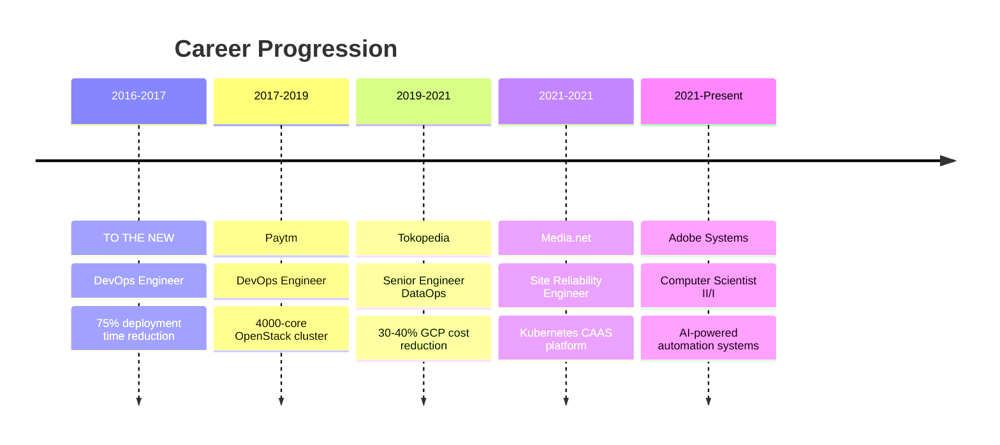

# 👋 Hi, I'm Parag Gupta

---

## 🚀 **Transforming Infrastructure Challenges into Elegant Solutions**

**Computer Scientist II @ Adobe** | **9+ Years Experience** | **AI Patent Holder**

I architect systems that handle **millions of transactions daily**, including **4000-core OpenStack clusters** and **AI-powered monitoring solutions** that reduced incident response time by **40%**. My approach combines technical expertise with business awareness, having delivered over **$500K in cost optimizations** while improving system reliability.

### 🎯 **Current Focus**
- 🤖 **AI-Powered Infrastructure**: Building intelligent monitoring and automation systems
- ☁️ **Cloud Architecture**: Designing scalable, resilient multi-cloud solutions  
- 📊 **Observability**: Creating unified monitoring platforms that provide actionable insights
- 🔐 **Security**: Implementing comprehensive security frameworks and compliance solutions

---

## 🏆 **Key Achievements**

<table>
<tr>
<td width="50%">

**💰 Business Impact**
- **$500K+** total cost savings delivered
- **$376K** annual savings through tech optimization
- **45%** cost reduction via cloud migrations
- **25-40%** operational cost improvements

</td>
<td width="50%">

**⚡ Performance Improvements**
- **40%** reduction in incident response time
- **85%** reduction in deployment errors
- **70%** improvement in troubleshooting efficiency
- **99.99%** uptime for mission-critical services

</td>
</tr>
</table>

### 🏅 **Recognition & Innovation**
- 🧠 **AI Patent Holder**: Revolutionary AIOps system for intelligent root cause analysis
- ⭐ **Rising Star Award**: Custom infrastructure management tool development
- 📝 **Technical Author**: Published insights on Kubernetes, Django, and AWS CodeDeploy

---

## 🛠️ **Tech Arsenal**

### **Cloud & Infrastructure**

### **Orchestration & DevOps**

### **Monitoring & Observability**

### **AI & Automation**

---

## 💼 **Professional Journey**

---

## 🌟 **Featured Projects**

| Project | Description | Impact |
|---------|-------------|---------|
| 🤖 **AIOps Patent** | AI-powered root cause analysis system | Revolutionary observability approach |
| ⚙️ **Ansible AI Assistant** | Natural language to playbook conversion | 80% automation time reduction |
| 📊 **Cortex VM Analyzer** | AI-powered metrics analysis platform | 30% infrastructure cost reduction |
| ☸️ **Kubernetes HA Cluster** | Enterprise-grade container platform | 99.99% uptime achievement |
| 🏗️ **Infrastructure as Code** | Multi-cloud Terraform modules | 70% deployment time reduction |

---

## 📈 **GitHub Analytics**

---

## 🤝 **Let's Connect & Collaborate**

### 🌐 **Professional Links**

### 💡 **Open to Opportunities**
🔹 **Staff SRE/DevOps Roles**  
🔹 **Cloud Architecture Consulting**  
🔹 **AI Infrastructure Projects**  
🔹 **Technical Leadership Positions**

---

  <i>⚡ "Turning imaginative infrastructure solutions into reality, one deployment at a time" ⚡</i>

---

**⭐ Star my repositories if you find them helpful!**

